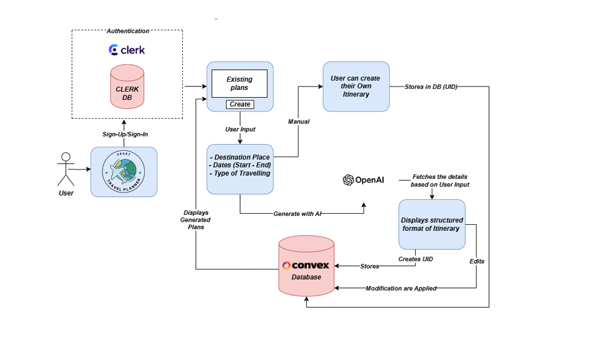

#Smart Travel Planner - Gateway to Seamless Smart Travel Plan
Welcome to Travel Planner AI, your ultimate travel companion designed to simplify the process of planning your next adventure.
Whether you're dreaming of a weekend getaway or a month-long expedition, Travel Planner AI is here to help you meticulously craft your next travel itinerary.

## Overview
Travel Planner AI is a Software as a Service (SaaS) product that leverages cutting-edge technologies to streamline the travel planning process.

## Key Functional Features
- **Top Spots Unveiled:** Discover hidden gems and popular attractions effortlessly.
- **Tailored Itineraries:** Plan your days seamlessly with custom-tailored schedules.
- **Optimal Timing:** Learn the best time to visit your destinations for an unparalleled experience.
- **Foodie Hotspots:** Indulge in culinary delights with recommendations from local experts.
- **Prime Experiences:** Immerse yourself in unforgettable moments curated just for you.
- **Expense Tracker:** Effectively track your expenses throughout your journey and can revisit later as well.
- **Email Invite:** Invite your friend and colleagues to your desired plan and collaborate together.(Not implemented yet)

## Architecture

## Installation
To run the Travel Planner AI, follow these steps:

1. Clone the repository
2. Navigate to the project directory: `cd travel-planner-ai`
3. Install the dependencies: `npm install`
4. Copy `env.sample` to `.env.local` and update the variables with your values
5. Start the development server: `npm run dev`
6. Open your browser and visit [http://localhost:3000](http://localhost:3000/) to see the app in action.

## Technologies Used
- Travel Planner AI is built using cutting-edge technologies to ensure a seamless user experience.
- **Next.js 14:** Leveraging the latest advancements in Next.js for efficient web application development.
- **Tailwind CSS with Shadcn-UI:** Utilizing Tailwind CSS with Shadcn-UI for responsive and visually stunning user interfaces.
- **Convex Backend Platform:** Powering our backend infrastructure for robust performance and scalability.
- **OpenAI APIs:** Harnessing the power of OpenAI's APIs for intelligent content generation and natural language processing.
- **Clerk:** Providing secure authentication solutions to safeguard user accounts and data.
- **Razorpay:** Facilitating seamless payment processing supporting wide range of payment methods.(Not implemented yet)
- **Resend:** For sending email invites using my custom domain.(Not implemented yet)

## Coming Soon
- **Email Invite:** Invite your friend and colleagues to your desired plan and collaborate together.
- **Razorpay:** Facilitating seamless payment processing supporting wide range of payment methods.
- **Resend:** For sending email invites using my custom domain.
- **Payment Gateway:** For processing payments securely and efficiently.